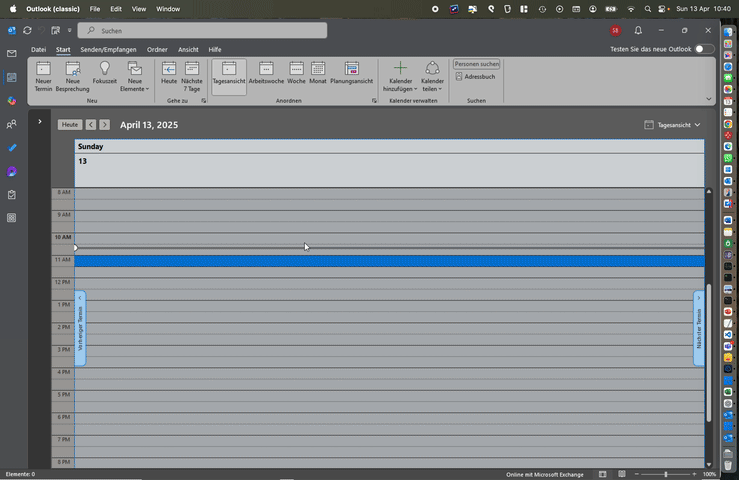

# 📅 Outlook Calendar Duplicate Add-in

## Why this add-in?

Microsoft Outlook no longer supports duplicating calendar events:  
🔗 [Outlook blocks copying meetings – Microsoft Support](https://support.microsoft.com/en-us/office/outlook-blocks-copying-meetings-with-copying-meetings-is-not-supported-4baaa023-2199-4833-b7ac-d9f0715d50f1)

This add-in offers a simple and practical workaround:  
It lets you duplicate an existing calendar event with just one click.

---

## ✨ What does the add-in do?

This Outlook add-in is intentionally **very simple and minimalistic**:

- It reads the **Subject** and **Body** of a selected calendar event.
- It creates a **new event**, placed right after the original one.
- That's it – no clutter, no configuration.

📸 See the GIF for an example:



---

## 🛠️ How to install

1. Download the [`manifest.xml`](https://raw.githubusercontent.com/Bry-Tech/dublicate-outlook-addin/refs/heads/main/manifest.xml?token=GHSAT0AAAAAAC5R5MALMFKX6FXXRIOVOR7SZ73PLKQ) file or use the public URL if available.
2. Open Outlook.
3. Go to **Home > Get Add-ins**.
4. Select **"My add-ins"**, then **"Add a custom add-in" > "Add from File..."** or **"Add from URL..."**.
5. Select the XML file or paste the URL.
6. Confirm and install.

---

## 📝 Notes

- The add-in works best with **Exchange Cached Mode disabled**.
- Requires **write permission** to your calendar.
- Compatible with both **classic Outlook and Outlook on the web**.

---

## 🤝 Contributors welcome!

Feel free to fork this repo, open issues, or submit pull requests.

Any improvements or bugfixes are highly appreciated!

---

## 📄 License

MIT License – free to use, modify, and distribute.

---

## Local Testing

1. Start the local dev server:
```bash
npm run dev-server
```

2. Visit https://localhost:3000 to accept the certificate

3. Install in Outlook Web:
   - Open [Outlook Web](https://aka.ms/olksideload)
   - Click settings ⚙️ (top right)
   - Search for "Add-ins" in the settings search
   - Choose "Custom add-ins" → "Add from file"
   - Upload `manifest_local.xml`

4. Debug the add-in:
   - Open browser dev tools (F12)
   - Check Console for logs


--

© [bryner.tech](https://www.bryner.tech)
